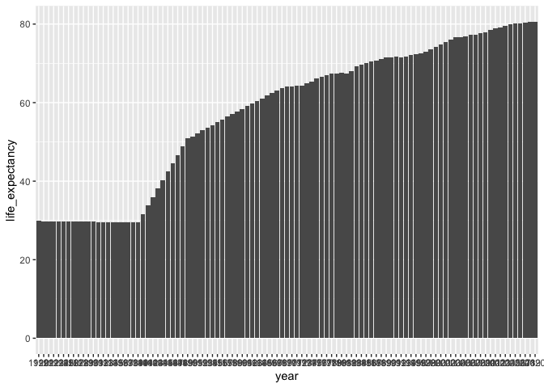
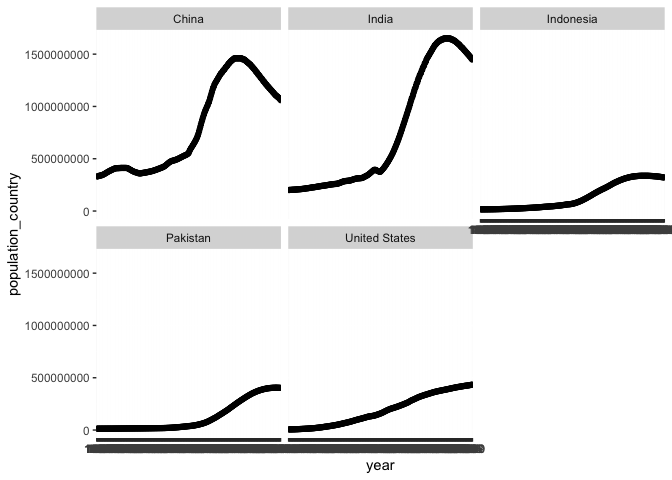
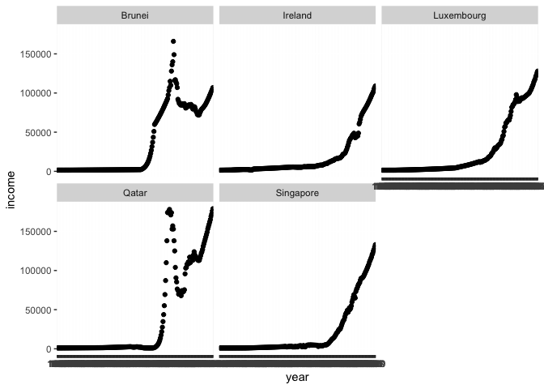
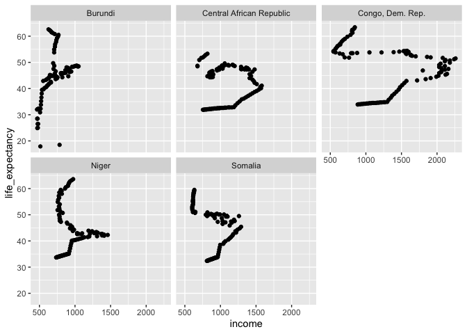

## Instructions
Answer the following questions and complete the exercises in RMarkdown. Please embed all of your code and push your final work to your repository. Your code should be organized, clean, and run free from errors. Be sure to **add your name** to the author header above. You may use any resources to answer these questions (including each other), but you may not post questions to Open Stacks or external help sites. There are 10 total questions.  

Make sure to use the formatting conventions of RMarkdown to make your report neat and clean! Your plots should use consistent aesthetics throughout. Feel free to be creative- there are many possible solutions to these questions!  

This exam is due by **12:00p on Tuesday, February 23**.  

## Load the libraries

```r
library(tidyverse)
```

```
## ── Attaching packages ─────────────────────────────────────── tidyverse 1.3.0 ──
```

```
## ✓ ggplot2 3.3.3     ✓ purrr   0.3.4
## ✓ tibble  3.1.0     ✓ dplyr   1.0.4
## ✓ tidyr   1.1.2     ✓ stringr 1.4.0
## ✓ readr   1.4.0     ✓ forcats 0.5.1
```

```
## ── Conflicts ────────────────────────────────────────── tidyverse_conflicts() ──
## x dplyr::filter() masks stats::filter()
## x dplyr::lag()    masks stats::lag()
```

```r
library(janitor)
```

```
## 
## Attaching package: 'janitor'
```

```
## The following objects are masked from 'package:stats':
## 
##     chisq.test, fisher.test
```

```r
library(here)
```

```
## here() starts at /Users/Joel/Desktop/BIS15W2021_jviswanathan
```

```r
options(scipen=999) #disables scientific notation when printing
```

<style>
div.blue { background-color:#e6f0ff; border-radius: 5px; padding: 20px;}
</style>
<div class = "blue">
## Gapminder
For this assignment, we are going to use data from  [gapminder](https://www.gapminder.org/). Gapminder includes information about economics, population, social issues, and life expectancy from countries all over the world. We will use three data sets, so please load all three.  

One thing to note is that the data include years beyond 2021. These are projections based on modeling done by the gapminder organization. Start by importing the data.  

# You can't use setwd in your code; it won't work on anybody else's computer. If you look at the path it points to your directory which they won't have. I suggest using the here package. If you write really nice code but it has directory issues then a lot of less experienced users won't even try it out.

```r
#setwd("~/Documents/GitHub/BIS15W2021_jviswanathan/midterm2/data")
```


```r
population <- read_csv(here("midterm2", "data", "population_total.csv"))
```

```
## 
## ── Column specification ────────────────────────────────────────────────────────
## cols(
##   .default = col_double(),
##   country = col_character()
## )
## ℹ Use `spec()` for the full column specifications.
```


```r
#setwd("~/Documents/GitHub/BIS15W2021_jviswanathan/midterm2/data")
income <- read_csv(here("midterm2", "data", "income_per_person_gdppercapita_ppp_inflation_adjusted.csv"))
```

```
## 
## ── Column specification ────────────────────────────────────────────────────────
## cols(
##   .default = col_double(),
##   country = col_character()
## )
## ℹ Use `spec()` for the full column specifications.
```


```r
#setwd("~/Documents/GitHub/BIS15W2021_jviswanathan/midterm2/data")
life_expectancy <- read_csv(here("midterm2", "data", "life_expectancy_years.csv"))
```

```
## 
## ── Column specification ────────────────────────────────────────────────────────
## cols(
##   .default = col_double(),
##   country = col_character()
## )
## ℹ Use `spec()` for the full column specifications.
```

</div>

<style>
div.blue { background-color:#e6f0ff; border-radius: 5px; padding: 20px;}
</style>
<div class = "blue">
1. (3 points) Once you have an idea of the structure of the data, please make each data set tidy and store them as new objects. You will need both the original and tidy data!

```r
population_tidy <- population %>%
  pivot_longer(!country, names_to = "year", values_to = "population_country") 

population_tidy
```

```
## # A tibble: 58,695 x 3
##    country     year  population_country
##    <chr>       <chr>              <dbl>
##  1 Afghanistan 1800             3280000
##  2 Afghanistan 1801             3280000
##  3 Afghanistan 1802             3280000
##  4 Afghanistan 1803             3280000
##  5 Afghanistan 1804             3280000
##  6 Afghanistan 1805             3280000
##  7 Afghanistan 1806             3280000
##  8 Afghanistan 1807             3280000
##  9 Afghanistan 1808             3280000
## 10 Afghanistan 1809             3280000
## # … with 58,685 more rows
```


```r
income_tidy <- income %>%
  pivot_longer(!country, names_to = "year", values_to = "income")

income_tidy
```

```
## # A tibble: 46,513 x 3
##    country     year  income
##    <chr>       <chr>  <dbl>
##  1 Afghanistan 1800     603
##  2 Afghanistan 1801     603
##  3 Afghanistan 1802     603
##  4 Afghanistan 1803     603
##  5 Afghanistan 1804     603
##  6 Afghanistan 1805     603
##  7 Afghanistan 1806     603
##  8 Afghanistan 1807     603
##  9 Afghanistan 1808     603
## 10 Afghanistan 1809     603
## # … with 46,503 more rows
```

# You forgot to change name of the data here. This affected all of your downstream analyses.

```r
#life_expectancy_tidy <- income %>%
#  pivot_longer(!country, names_to = "year", values_to = "life_expectancy")

#life_expectancy_tidy
```

# It should be like this.

```r
life_expectancy_tidy <- life_expectancy %>%
  pivot_longer(!country, names_to = "year", values_to = "life_expectancy")

life_expectancy_tidy
```

```
## # A tibble: 56,287 x 3
##    country     year  life_expectancy
##    <chr>       <chr>           <dbl>
##  1 Afghanistan 1800             28.2
##  2 Afghanistan 1801             28.2
##  3 Afghanistan 1802             28.2
##  4 Afghanistan 1803             28.2
##  5 Afghanistan 1804             28.2
##  6 Afghanistan 1805             28.2
##  7 Afghanistan 1806             28.1
##  8 Afghanistan 1807             28.1
##  9 Afghanistan 1808             28.1
## 10 Afghanistan 1809             28.1
## # … with 56,277 more rows
```

</div>

2. (1 point) How many different countries are represented in the data? Provide the total number and their names. Since each data set includes different numbers of countries, you will need to do this for each one.

```r
population_tidy %>%
  summarise(n_countries = n_distinct(country))
```

```
## # A tibble: 1 x 1
##   n_countries
##         <int>
## 1         195
```


```r
income_tidy %>%
  summarise(n_countries = n_distinct(country))
```

```
## # A tibble: 1 x 1
##   n_countries
##         <int>
## 1         193
```


```r
life_expectancy_tidy %>%
  summarise(n_countries = n_distinct(country))
```

```
## # A tibble: 1 x 1
##   n_countries
##         <int>
## 1         187
```

<style>
div.blue { background-color:#e6f0ff; border-radius: 5px; padding: 20px;}
</style>
<div class = "blue">

## Life Expectancy  

3. (2 points) Let's limit the data to the past 100 years (1920-2020). For these years, which country has the highest life expectancy? How about the lowest life expectancy?  

Highest

```r
life_expectancy_tidy %>%
  filter(year >= 1920, year <= 2020) %>%
  group_by(country) %>%
  summarise(maximum_life_expectancy = max(life_expectancy)) %>%
  arrange(desc(maximum_life_expectancy))
```

```
## # A tibble: 187 x 2
##    country     maximum_life_expectancy
##    <chr>                         <dbl>
##  1 Singapore                      85.3
##  2 Japan                          84.7
##  3 Switzerland                    84.4
##  4 Italy                          83.6
##  5 Spain                          83.5
##  6 Israel                         83.4
##  7 Kuwait                         83.4
##  8 France                         83.2
##  9 Iceland                        83.2
## 10 South Korea                    83.2
## # … with 177 more rows
```

```r
#united arab emirates has the highest life expectancy.
```

Lowest

```r
life_expectancy_tidy %>%
  filter(year >= 1920, year <= 2020) %>%
  group_by(country) %>%
  summarise(lowest_life_expectancy = min(life_expectancy)) %>%
  arrange((lowest_life_expectancy))
```

```
## # A tibble: 187 x 2
##    country         lowest_life_expectancy
##    <chr>                            <dbl>
##  1 Kazakhstan                        4.07
##  2 Ukraine                           8.94
##  3 Rwanda                            9.64
##  4 Pakistan                         11.1 
##  5 Kyrgyz Republic                  11.9 
##  6 Lithuania                        12   
##  7 Belarus                          13.9 
##  8 Turkmenistan                     14.2 
##  9 Poland                           15.4 
## 10 Tajikistan                       15.7 
## # … with 177 more rows
```

```r
#mozambique has the lowest life expectancy.
```
</div>

4. (3 points) Although we can see which country has the highest life expectancy for the past 100 years, we don't know which countries have changed the most. What are the top 5 countries that have experienced the biggest improvement in life expectancy between 1920-2020?

```r
life_expectancy_tidy %>%
  filter(year == 1920 | year == 2020) %>%
  pivot_wider(
    names_from = "year",
    names_prefix = "yr_",
    values_from = "life_expectancy"
  ) %>%
  mutate(change_life_expectancy = yr_2020 - yr_1920) %>%
  arrange(desc(change_life_expectancy))
```

```
## # A tibble: 187 x 4
##    country         yr_1920 yr_2020 change_life_expectancy
##    <chr>             <dbl>   <dbl>                  <dbl>
##  1 Kuwait             26.6    83.4                   56.8
##  2 Kyrgyz Republic    16.6    73.1                   56.5
##  3 Turkmenistan       15.2    70.5                   55.3
##  4 South Korea        28.2    83.2                   55  
##  5 Tajikistan         16.7    71                     54.3
##  6 Nicaragua          25.3    79.5                   54.2
##  7 Kazakhstan         19.3    73.1                   53.8
##  8 Russia             20.5    72.7                   52.2
##  9 Israel             32      83.4                   51.4
## 10 Iran               26.8    78                     51.2
## # … with 177 more rows
```

```r
#quatar, luxembourg, singapore, brunei, ireland. 
```
<style>
div.blue { background-color:#e6f0ff; border-radius: 5px; padding: 20px;}
</style>
<div class = "blue">

# You need to make adjustments to the aesthetics here as the x axis is not legible.

5. (3 points) Make a plot that shows the change over the past 100 years for the country with the biggest improvement in life expectancy. Be sure to add appropriate aesthetics to make the plot clean and clear. Once you have made the plot, do a little internet searching and see if you can discover what historical event may have contributed to this remarkable change.  


```r
life_expectancy_tidy %>%
  filter(country == "Qatar") %>%
  filter(year >= 1920, year <= 2020) %>%
  ggplot(aes(x = year, y = life_expectancy)) +
  geom_col() #this change in life expectancy may be due to world war I. 
```

<!-- -->

</div>

## Population Growth
6. (3 points) Which 5 countries have had the highest population growth over the past 100 years (1920-2020)?

```r
population_tidy %>%
  filter(year == 1920 | year == 2020) %>%
  pivot_wider(names_from = "year", names_prefix = "yr_", values_from = population_country) %>%
  mutate(change_population = yr_2020 - yr_1920) %>%
  arrange(desc(change_population))
```

```
## # A tibble: 195 x 4
##    country         yr_1920    yr_2020 change_population
##    <chr>             <dbl>      <dbl>             <dbl>
##  1 India         317000000 1380000000        1063000000
##  2 China         472000000 1440000000         968000000
##  3 Indonesia      47300000  274000000         226700000
##  4 United States 111000000  331000000         220000000
##  5 Pakistan       21700000  221000000         199300000
##  6 Brazil         27600000  213000000         185400000
##  7 Nigeria        23300000  206000000         182700000
##  8 Bangladesh     27300000  165000000         137700000
##  9 Mexico         14800000  129000000         114200000
## 10 Philippines     9400000  110000000         100600000
## # … with 185 more rows
```

```r
#india, china, indonesia, united states, pakistan. 
```

7. (4 points) Produce a plot that shows the 5 countries that have had the highest population growth over the past 100 years (1920-2020). Which countries appear to have had exponential growth?  

```r
population_tidy %>%
  filter(country == "India" | country == "China" | country == "Indonesia" |country == "United States" |country == "Pakistan") %>%
  ggplot(aes(x = year, y = population_country))+
  geom_point() +
  facet_wrap(~country)
```

<!-- -->

```r
#china and india. 
```

## Income
The units used for income are gross domestic product per person adjusted for differences in purchasing power in international dollars.

8. (4 points) As in the previous questions, which countries have experienced the biggest growth in per person GDP. Show this as a table and then plot the changes for the top 5 countries. With a bit of research, you should be able to explain the dramatic downturns of the wealthiest economies that occurred during the 1980's.

```r
income_tidy %>%
  filter(year == 1920 | year == 2020) %>%
  pivot_wider(names_from = "year", names_prefix = "yr_", values_from = income) %>%
  mutate(change_income = yr_2020 - yr_1920) %>%
  arrange(desc(change_income)) 
```

```
## # A tibble: 193 x 4
##    country              yr_1920 yr_2020 change_income
##    <chr>                  <dbl>   <dbl>         <dbl>
##  1 Qatar                   2300  116000        113700
##  2 Luxembourg              5730   95100         89370
##  3 Singapore               2440   90500         88060
##  4 Brunei                  2130   75100         72970
##  5 Ireland                 5170   74100         68930
##  6 United Arab Emirates    2090   65300         63210
##  7 Kuwait                  2350   64300         61950
##  8 Norway                  8960   67500         58540
##  9 Monaco                  6630   62000         55370
## 10 San Marino              3280   57900         54620
## # … with 183 more rows
```

```r
income_tidy %>%
  filter(country == "Qatar" | country == "Luxembourg" |country == "Singapore" |country == "Brunei" |country == "Ireland") %>%
  ggplot(aes(x = year, y = income)) +
  geom_point() +
  facet_wrap(~country) #economic downturn in the 80s likely occurred because of thw 1980 recession, a result of sharp increases in oil prices. 
```

<!-- -->

9. (3 points) Create three new objects that restrict each data set (life expectancy, population, income) to the years 1920-2020. Hint: I suggest doing this with the long form of your data. Once this is done, merge all three data sets using the code I provide below. You may need to adjust the code depending on how you have named your objects. I called mine `life_expectancy_100`, `population_100`, and `income_100`. For some of you, learning these `joins` will be important for your project.  

life_expectancy_100

```r
life_expectancy_100 <- life_expectancy_tidy %>%
  filter(year <= 2020, year >= 1920)
```

population_100

```r
population_100 <- population_tidy %>%
  filter(year <= 2020, year >= 1920)
```

income_100

```r
income_100 <- income_tidy %>%
  filter(year <= 2020, year >= 1920)
```


```r
gapminder_join <- inner_join(life_expectancy_100, population_100, by= c("country", "year"))
gapminder_join <- inner_join(gapminder_join, income_100, by= c("country", "year"))
gapminder_join
```

```
## # A tibble: 18,887 x 5
##    country     year  life_expectancy population_country income
##    <chr>       <chr>           <dbl>              <dbl>  <dbl>
##  1 Afghanistan 1920             30.6           10600000   1490
##  2 Afghanistan 1921             30.7           10500000   1520
##  3 Afghanistan 1922             30.8           10300000   1550
##  4 Afghanistan 1923             30.8            9710000   1570
##  5 Afghanistan 1924             30.9            9200000   1600
##  6 Afghanistan 1925             31              8720000   1630
##  7 Afghanistan 1926             31              8260000   1650
##  8 Afghanistan 1927             31.1            7830000   1680
##  9 Afghanistan 1928             31.1            7420000   1710
## 10 Afghanistan 1929             31.2            7100000   1740
## # … with 18,877 more rows
```

10. (4 points) Use the joined data to perform an analysis of your choice. The analysis should include a comparison between two or more of the variables `life_expectancy`, `population`, or `income.`

```r
#which countries have lowest income in 2020?
gapminder_join %>%
  filter(year == "2020") %>%
  arrange((income)) 
```

```
## # A tibble: 187 x 5
##    country                  year  life_expectancy population_country income
##    <chr>                    <chr>           <dbl>              <dbl>  <dbl>
##  1 Burundi                  2020             62.6           11900000    628
##  2 Somalia                  2020             59.5           15900000    633
##  3 Central African Republic 2020             53.3            4830000    817
##  4 Congo, Dem. Rep.         2020             63.4           89600000    845
##  5 Niger                    2020             63.6           24200000    974
##  6 Liberia                  2020             65.5            5060000   1130
##  7 Malawi                   2020             64.6           19100000   1210
##  8 Mozambique               2020             60.4           31300000   1210
##  9 Eritrea                  2020             63.8            3550000   1420
## 10 Sierra Leone             2020             61.7            7980000   1500
## # … with 177 more rows
```

```r
#what is the relationship between income and life expectancy?
gapminder_join %>%
  filter(country == "Burundi" | country == "Somalia" | country == "Central African Republic" | country == "Congo, Dem. Rep." | country == "Niger") %>%
  ggplot(aes(x = income, y = life_expectancy)) +
  geom_point() +
  facet_wrap(~country)
```

<!-- -->

# Hi Jayashri, It seems that many of the analyses your performed were based on incorrectly importing the data. I fixed this for you, but it didn't correct all of the issues. Also, some of the aesthetics in your plots need some work as they are not legible. I like that you tried faceting, but some of the figures were hard to read. I am happy to help if you have questions. Dr. L
